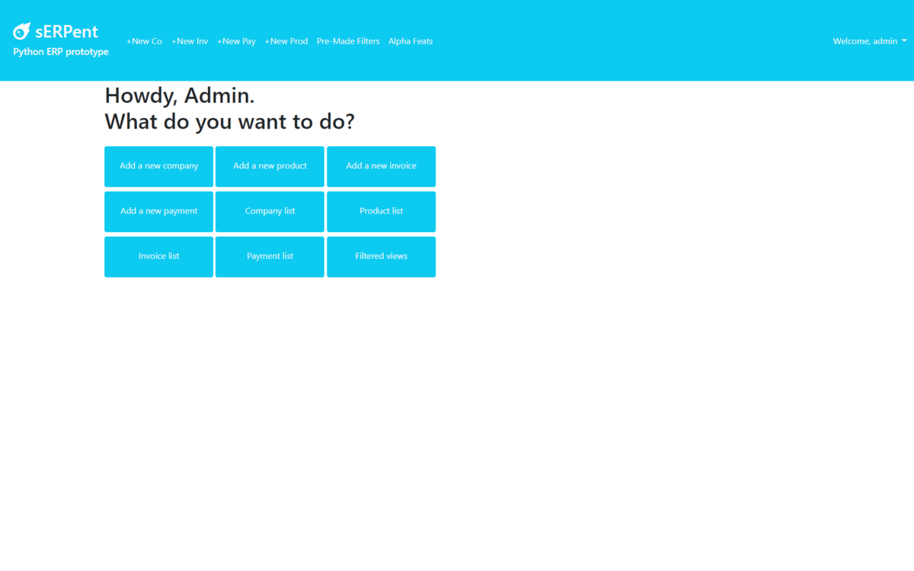

  [](https://makeapullrequest.com)

# sERPent - A Django ERP prototype
Creating an Enterprise Resource Planner (ERP) software that may helps me managing my company. Currently WIP. 

## Environment setup and quick-start

**About my prod env:** code has been build and tested on Django 4.0.2 and Python 3.8.8 running on Win11 machine.

1. Clone the project: `git clone https://github.com/smart-coder997/django-erp.git`.
2. Create a virtual environment (conda `conda create -n my_env pip python=3.8`) (python `python3 -m venv my_env`).
3. Activate your virtual environment: (conda`conda activate my_env`) (Linux/MacOS `source my_env/bin/activate`) (Windows `source my_env/Scripts/activate`).
4. Install requirements.txt: `pip install -r requirements.txt`.
5. Create a `.env` file with your SECRET KEY
6. Navigate to the `erp` folder you want.
7. Make migrations with: `python manage.py makemigrations` and apply them with  `python manage.py migrate`.
8. Let's start the engine with `python manage.py runserver`.
9. Have fun! :)

### Use docker-compose

Run it in Docker with ```docker-compose up django_erp```

## Business Logic

The underlying idea is being able to quickly create templates for Companies and Products and cloning them upon necessity.<br>
Payments and Invoices are expected to be inserted from time to time.<br>
The filtered views allow to have a quick overview of how's the business going, specifically having in mind the daily checks you have to perform on outstanding credits and debits and invoices. <br>
I may be willing to extend reporting features a bit, it depends from the free time I have to allocate on this project. <br>

## Testing

To run the automated test, input `python manage.py test --parallel auto --verbosity=2`.<br>
Use predefined docker-compose service if docker is available:<br>
```docker-compose  -f docker-compose.test.yaml run --rm  django_erp_tests```<br>

At the moment there are more near 100 test cases, covering from models, to forms, to views, and their underlying logics.

## Frontend

I took a personal challenge in tryin to do the whole project with Bootstrap 5, without using CSS stylesheet (that is in fact just made up of 3 row of code).

## Example screenshots (video)



## Features

List of all the available feature as per 14 Sept 2022

<strong>Data entry</strong>
    <li>Create a new user (backend only)</li>
    <li>Create a new user group (backend only)</li>
    <li>Create a new company</li>
    <li>Create a new product</li>
    <li>Create a new invoice</li>
    <li>Create a new payment</li>
    <li>Update a company</li>
    <li>Update a product</li>
    <li>Update an invoice</li>
    <li>Update a payment</li>
    <li>Clone a company</li>
    <li>Clone a product</li>
    <li>Clone an invoice</li>
    <li>Clone a payment</li>

<strong>Automations</strong>
    <li>Private Web APIs (GET, HEAD, OPTIONS) for the whole dataset</li>
    <li>Unit testing </li>
    <li>See a list of all the companies, with dynamic filters and CSV export</li>
    <li>See a list of all the products, with dynamic filters and CSV export</li>
    <li>See a list of all the invoices, with dynamic filters and CSV export</li>
    <li>Automatically update product quantity for each invoice and flag refill needed if quantity is under a given threshold</li>
    <li>Report open credits position</li>
    <li>Report open debits position</li>
    <li>Report all active invoices </li>
    <li>Report all active payments </li>
    <li>Report all passive invoices </li>
    <li>Report overdue active invoices </li>
    <li>Report overdue passive invoices </li>

## Walkthrough
I created also some additional walktrought that should help you configuring your Django project:<br>

- [The django walkthrough](django_walktrought.md).<br>
- [A list of useful commands](CLI_commands.md).<br>

## Contribute
Every feedback and contributions are welcome.
Please just:
1. Open an issue and discuss the changes you'd like to make or the bug\issue you'd like to report.<br>
2. Once ready to submit a pull request, provide proof of the testing you've done.<br>

### Contributors
- [panjacek](https://github.com/panjacek) 
